## Virtual IP for vCenter

### Context

As documented in (Designated IP ranges for Arc resource bridge)[https://learn.microsoft.com/azure/azure-arc/resource-bridge/network-requirements#designated-ip-ranges-for-arc-resource-bridge], IP address `10.244.0.0/16` is reserved internally. If customers are using address space which includes this reserved IP address as a AVS private cloud address (e.g. `10.244.0.0/22`) then network traffic originating from Arc resource bridge towards AVS vCenter Server will fail. This behaviour is caused due to appliance VM treating `10.244.0.2` is an address inside the pod network, and the traffic could not be routed out of the appliance VM.

## Solution Approach

To avoid such overlapping IP addresses between Azure Arc resource bridge and vCenter Server, we can use a virtual/intermidiate IP address for the vCenter, which is outside the `10.244.*` range.

High level design will look like below.
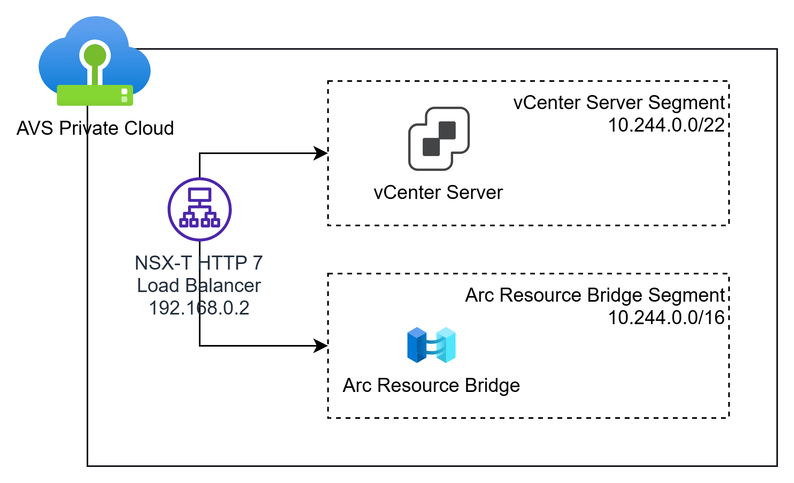

vCenter Server Segment address space (`10.244.0.0/22`) and Arc Resource Bridge Segment (`10.244.0.0/16`) are replaced by alternate address spaces in this guidance. However, idea remains same - to allow connectivity via another IP address to avoid IP address overlap.

We need to select some IP address which is not already used in any Segments. For example, in the AVS lab setup `VMWAREAVS-arcprivatecloudsfte`, the RFC 1918 addresses which are used / not used are as follows:

1. `10.0.0.0/8` : Used by AVS
   

2. `172.16.0.0/12`: Used / will be used by the segments
    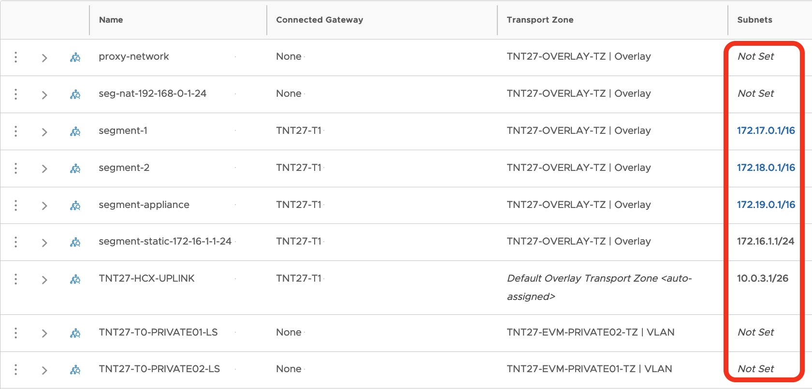

3. `192.168.0.0/16`: Not used in AVS segments - only used in isolated networks (example proxy network setup).

4. Ensure that `192.168.0.0/16` is not used as either DNS or DHCP address.

Hence, we can use an IP address from `192.168.0.0/16` as an intermediate IP address so that Arc resource bridge can use it to connect with vCenter Server.

> [!NOTE]
> Which IP to choose?
> We could have also used some other IP in private address range, e.g., `10.220.0.2`, which might work as well - typically AVS does not use the full `/8` range.
>
> If we use a public IP, eg, `193.168.0.2`, then we lose access to the actual server in the internet which has this IP.
>
> We just need to ensure that the IP address is not used in any of the segments.

> [!WARNING]
> It is important to note that OVA image upload in cloud-managed upgrade will fail
> on Day N, because image upload will make **connection to the IP address of some ESXi host**
> **from inside the k8s pod.** This IP will also fall in 10.244.0.0/16 range, and the host IPs
> are typically dynamic (hosts can come and go, ephemeral in AVS). Hence, it will be difficult to provide virtual IP for ESXi hosts.
>
> However, manual upgrade (`az arcappliance updgrade`) will work 
> since it uploads image from the management machine.

## Unsuccessful Attempt - DNAT

<details>

<summary>Click to view details</summary>

We tried adding a DNAT rule in the NSX-T NAT so that packets destined to `192.168.0.2` are DNATed to `10.0.0.2`. However, the following happens:
1. After leaving the source machine, destination `192.168.0.2` is translated to `10.0.0.2`.
2. VCenter receives the packet and does `ACK`.
3. The `ACK` packet is sent back to the source machine. However, `10.0.0.2` is not translated back to `192.168.0.2` before reaching the source machine. Hence, the source machine drops the packet (TCP RST).

We don't know the actual reason for this yet.

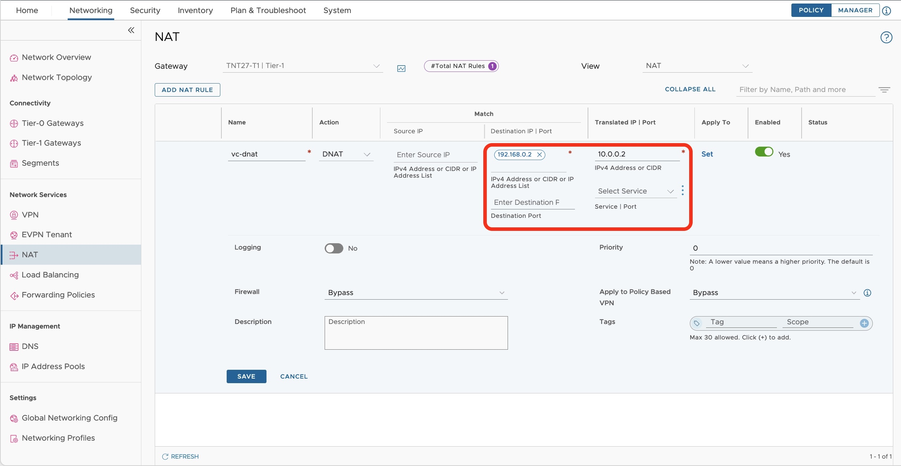

</details>

## Successful Attempt - L7 Load Balancer

We can use the NSX-T L7 Load Balancer to achieve the same. The steps are as follows:

1. Create a server pool. (let the name be `vc-server-pool`)

    **Set SNAT Translation Mode to `Disabled`. The default is `Automap`.**

    > Automap means that the source IP address of the packet is translated to the IP address of the load balancer.
    > Disabled means that the source IP address of the packet is not translated.

    Since, we are using a virtual IP for the Load Balancer, which does not exist in the AVS, we should not translate the Source IP address of the packet to the Load Balancer IP address. If we map it, then the ACK packets from the VCenter will be sent to the Load Balancer IP address which does not exist, and we will get 504 Gateway Timeout error.

    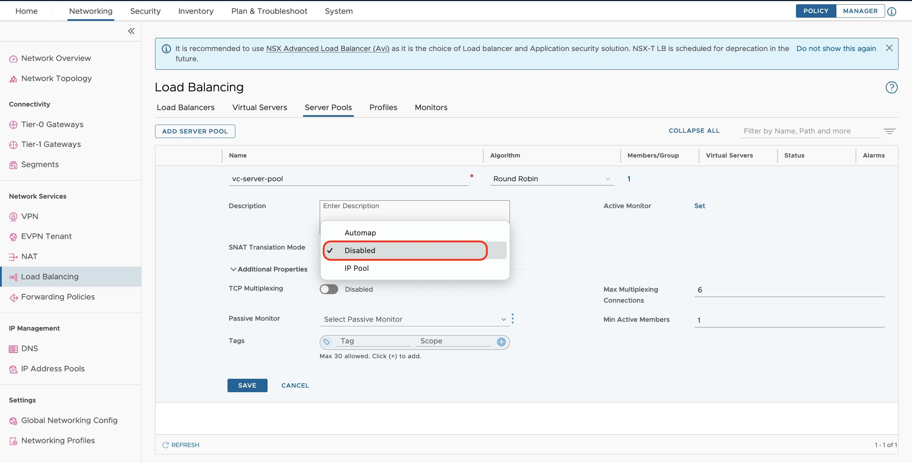

2. Add members to the server pool. In this case, we have only one member which is the VCenter Server IP address: `10.0.0.2`.

    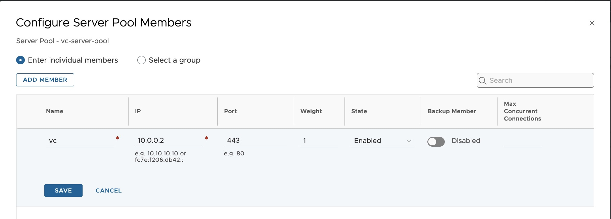

3. Create the load balancer (let the name be `vc-lb`)

    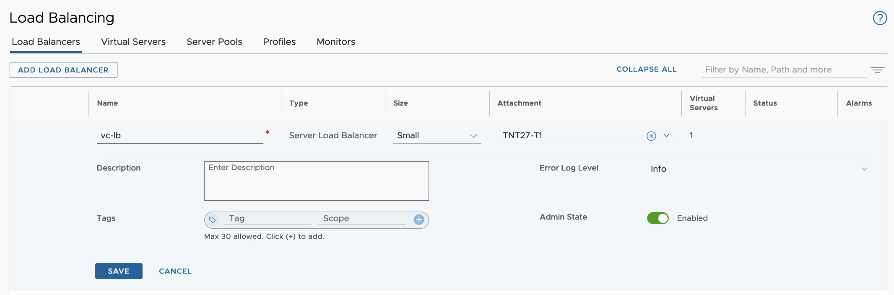

4. The communication to the vCenter happens on port 443. Hence we need some SSL certificate to be present on the load balancer. We can generate and use a self-signed certificate for this purpose in the NSX-T Manager.

    Generate Signed Certificate                                         |  Add details
    :------------------------------------------------------:|:-------------------------:
    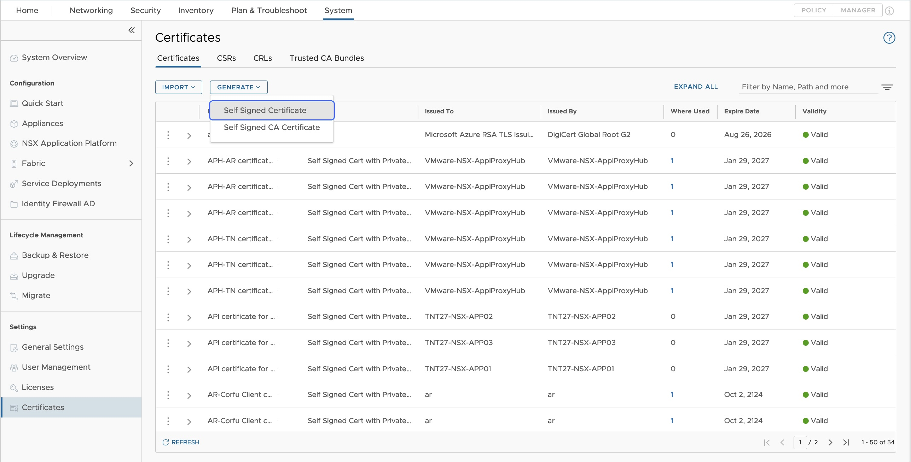  |  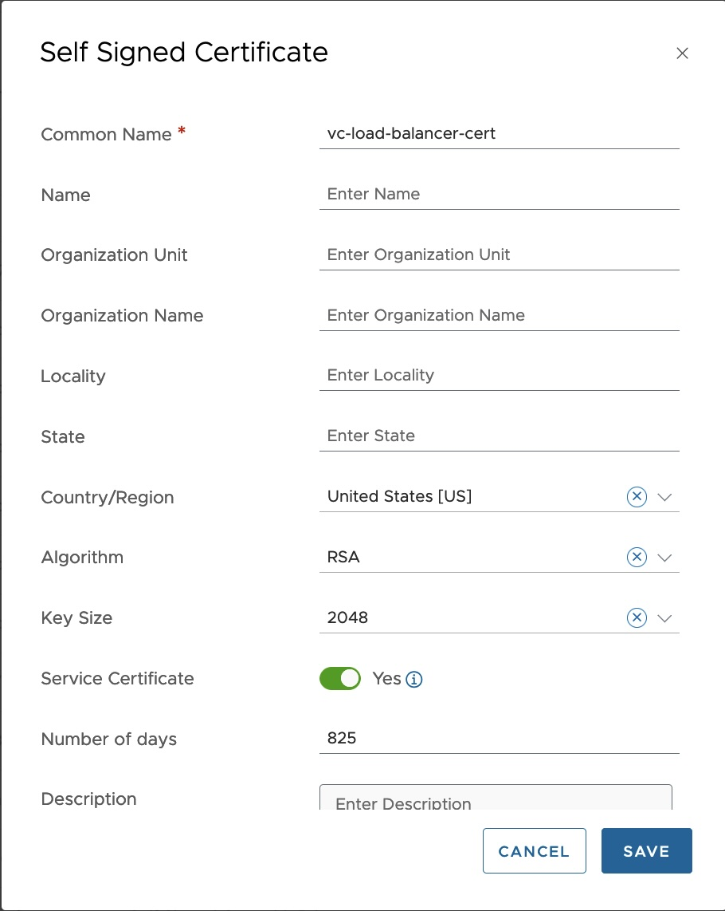

5. Create a virtual server. The virtual server is the virtual IP address which the clients will use to connect to the vCenter. In this case, it is `192.168.0.2`.
    - IP Address: `192.168.0.2`
    - Port: `443`
    - Load Balancer: `vc-lb` (from step 3)
    - Server Pool: `vc-server-pool` (from step 1)

    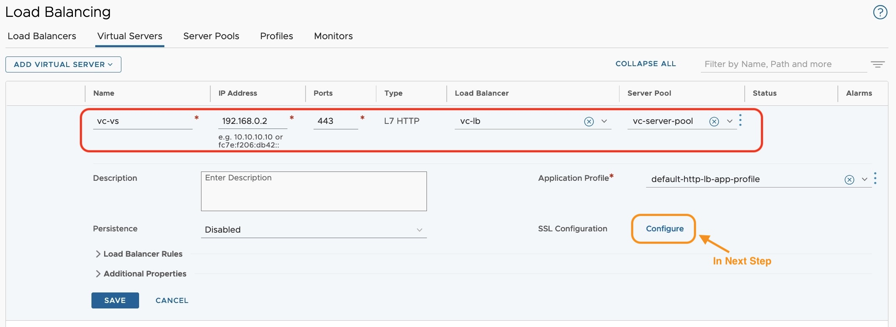

6. Click on `SSL Configuration`, enable both Client and Server SSL, and select the certificate which we created in step 4.

    Client SSL                                        |  Server SSL
    :------------------------------------------------:|:-------------------------:
    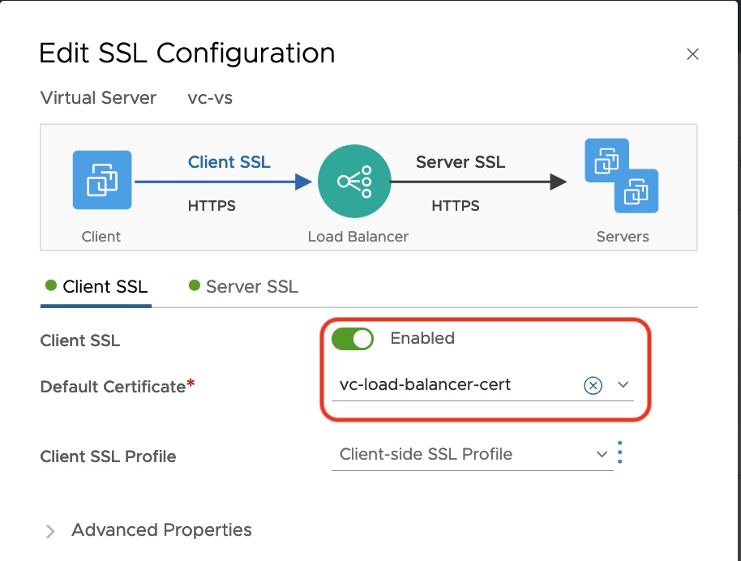  |  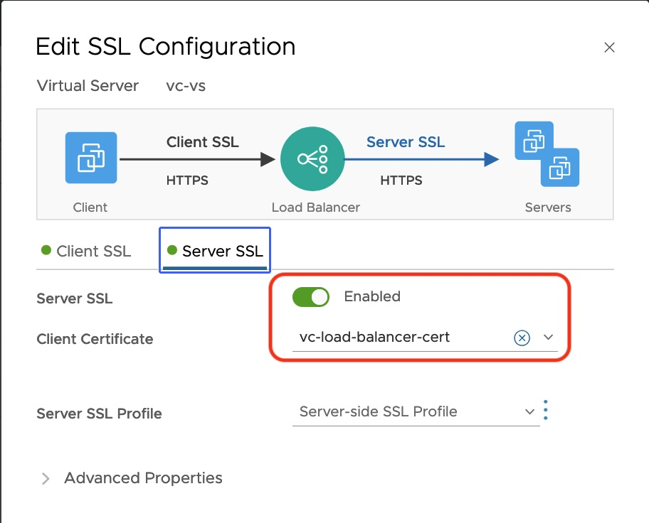

7. Now, we can access the vCenter using the virtual IP address `192.168.0.2`.

    ```sh
    curl -vI -k https://192.168.0.2
    *   Trying 192.168.0.2:443...
    * Connected to 192.168.0.2 (192.168.0.2) port 443
    * ALPN: curl offers h2,http/1.1
    ...
    * TLSv1.2 (OUT), TLS handshake, Finished (20):
    * TLSv1.2 (IN), TLS handshake, Finished (20):
    * SSL connection using TLSv1.2 / ECDHE-RSA-AES128-GCM-SHA256 / prime256v1 / rsaEncryption
    * ALPN: server accepted http/1.1
    * Server certificate:
    *  subject: CN=vc-load-balancer-cert; C=US
    *  start date: Oct 29 14:09:24 2024 GMT
    *  expire date: Feb  1 14:09:24 2027 GMT
    *  issuer: CN=vc-load-balancer-cert; C=US
    *  SSL certificate verify result: self-signed certificate (18), continuing anyway.
    *   Certificate level 0: Public key type RSA (2048/112 Bits/secBits), signed using sha256WithRSAEncryption
    * using HTTP/1.x
    > HEAD / HTTP/1.1
    > Host: 192.168.0.2
    > User-Agent: curl/8.5.0
    > Accept: */*
    >
    < HTTP/1.1 200 OK
    HTTP/1.1 200 OK
    ...
    ```