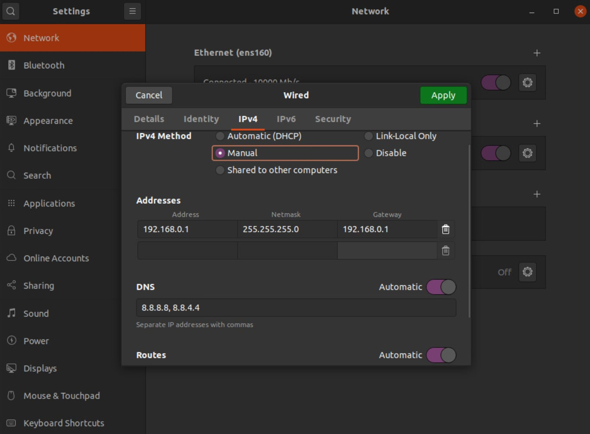

# How to create an isolated network with internet access only through the proxy network.

## Existing network

A network segment that has internet access.<br/>
We'll be calling it `internet-segment` hereafter, with subnet `172.16.0.0/22`.

## Network topology we need to create for an isolated proxy network

We need to create a new segment where internet can be accessed only behind a proxy server.<br/>
We'll be calling it `proxy-segment` hereafter, with subnet `192.168.0.0/24`.<br/>
We need not assign any IP subnet from the portal where we are going to create the segment,
since we will have our own DHCP server.

We should assign a static IP to the DHCP server and the Proxy Server. We can run both the service in the same server too.

The network topology should look like this.


## 1. Set up the isolated network

1.  Create an Ubuntu VM that has 2 NICs.
    - `eth0` is connected to `proxy-segment`.
    - `eth1` is connected to `internet-segment`.

     The IP of `eth1` can either be statically assigned or can be obtained via a DHCP server running on `internet-segment`.

2.  Assign a static IP `192.168.0.1` to `eth0`.
    - [New method][1]
    - [Old Method][2]
    You can set via GUI like this:
    

3.  Run DHCP and DNS Server on the VM. [Ref1][3], [Ref2][4]
    
    If you don't want to set static network configuration for all VMs connected to `proxy-segment`, you will need a DHCP Server. We can install the DHCP server on the same machine where proxy server will be installed. We could have a DNS server in the network too in order to resolve local addresses.<br/>
    [`dnsmasq`][dnsmasq_arch] can serve for both the purposes.

    1.  Install dnsmasq
        ```
        sudo systemctl disable systemd-resolved
        sudo systemctl stop systemd-resolved
        sudo rm /etc/resolv.conf
        echo nameserver 8.8.8.8 | sudo tee /etc/resolv.conf
        sudo apt install -y dnsmasq
        ```
      
    2.  Edit file `/etc/dnsmasq.conf`.
        ```conf
        listen-address=192.168.0.1
        dhcp-range=192.168.0.100,192.168.0.240,12h
        dhcp-option=option:router,192.168.0.1
        dhcp-option=option:dns-server,192.168.0.1,8.8.8.8
        dhcp-leasefile=/var/lib/misc/dnsmasq.leases
        dhcp-authoritative
        ```
    
    4.  Restart the dnsmsq service.
        ```bash
        sudo systemctl restart dnsmasq
        ```

## 2. Run squid proxy

1. Install docker [Ref][5]

```bash
sudo apt install apt-transport-https ca-certificates curl software-properties-common
curl -fsSL https://download.docker.com/linux/ubuntu/gpg | sudo apt-key add -
sudo add-apt-repository "deb [arch=amd64] https://download.docker.com/linux/ubuntu $(lsb_release -cs) stable"
sudo apt-get update && sudo apt-get install -y docker-ce docker-ce-cli containerd.io
sudo usermod -aG docker $USER
```

2. Clone the repository

```bash
git clone https://github.com/nascarsayan/squid-proxy-setup
cd squid-proxy-setup
```

3. Create / Update the files required by squid

    1.  Create CA certificates (Required only for SSL-Proxy)

        We create an SSL certificate and add it to the squid container
        ```bash
        CN="proxy-ca"
        openssl genrsa -out ./files/proxy-ca.key 4096
        openssl req -x509 -new -nodes -key ./files/proxy-ca.key -sha256 -subj "/C=US/ST=CA/CN=$CN" -days 1024 -out ./files/proxy-ca.crt
        ```
        `proxy-ca.crt` is the SSL certificate that will be required to be trusted by the clients who want to use SSL proxy.
    
    2.  Create user credentials (Required only for basic auth)

        For configuring basic auth, i.e., [NCSA auth][6]:<br/>
        Intall htpasswd if not already installed.
        ```bash
        sudo apt install apache2-utils
        ```

        Create the proxy auth credentials file
        ```bash
        # $username, $password will have to be supplied to authenticate to the proxy server
        htpasswd -c ./files/usercreds $username
        # Enter the password when prompted
        ```

    3.  Modify `files/squid.conf` as per your requirement.<br/>
        Any files that you want to copy to the squid container can be put into `files/`.
        The whole directory will be shared as a volume mount to the squid container.

    4.  Start proxy: [`./start.sh`](./start.sh)<br/>
        View access logs: [`./tail_access_logs.sh`](./tail_access_logs.sh)<br/>
        Stop proxy: [`./stop.sh`](./stop.sh)<br/>
    

## 3. Machine behind proxy server

Create another VM which is connected to only `proxy-segment`. We will be using this as the dev machine for testing proxy scenarios.

Once the machine starts up it should receive an IP address in the range `192.168.0.100-192.168.0.240`.

For using SSL proxy you need to trust the `proxy-ca.crt` file that was generated in the proxy server and included in the squid configuration file.
Copy the CA certificate to the client machine, and trust it. To trust it:
  1. [add it to trusted root of the machine][7]
  2. Set the environment variable `REQUESTS_CA_BUNDLE=/path/to/proxy-ca.crt`

Option `1` is the safer one.

```bash
# Only for SSL proxy
scp 192.168.0.1:~/squid-proxy-setup/files/proxy-ca.crt .
sudo cp proxy-ca.crt /usr/local/share/ca-certificates/ # The trusted-root path can be different, depending on the Linux distro. Check the link above
sudo update-ca-certificates
export REQUESTS_CA_BUNDLE=/usr/local/share/ca-certificates/proxy-ca.crt
```

Assuming the proxy ports were unchanged in `squid.conf`, the proxy server is listening to:
- Non-SSL Proxy: `192.168.0.1:3128`
- SSL Proxy: `192.168.0.1:3129`

Set these environment variables (after replacing the `$values`) in `~/.bashrc`:
```bash
proxy_url="http://$username:$password@$host:$port"
export HTTP_PROXY=$proxy_url
export HTTPS_PROXY=$proxy_url
export FTP_PROXY=$proxy_url
export http_proxy=$proxy_url
export https_proxy=$proxy_url
export ftp_proxy=$proxy_url
export no_proxy='.svc,kubernetes.default.svc,192.168.0.0/24,localhost,127.0.0.0/8,10.96.0.0/12,10.244.0.0/16,10.224.0.0/16'
export NO_PROXY='.svc,kubernetes.default.svc,192.168.0.0/24,localhost,127.0.0.0/8,10.96.0.0/12,10.244.0.0/16,10.224.0.0/16'
```

To pass environment variables during sudo, you can run `sudo -E` 


[1]: https://linuxconfig.org/how-to-configure-static-ip-address-on-ubuntu-18-04-bionic-beaver-linux
[2]: https://www.tecmint.com/set-add-static-ip-address-in-linux/
[3]: https://computingforgeeks.com/install-and-configure-dnsmasq-on-ubuntu/
[4]: https://www.tecmint.com/setup-a-dns-dhcp-server-using-dnsmasq-on-centos-rhel/
[5]: https://www.digitalocean.com/community/tutorials/how-to-install-and-use-docker-on-ubuntu-20-04
[6]: http://en.wikipedia.org/wiki/NCSA_HTTPd
[7]: https://manuals.gfi.com/en/kerio/connect/content/server-configuration/ssl-certificates/adding-trusted-root-certificates-to-the-server-1605.html
[dnsmasq_arch]: https://wiki.archlinux.org/title/dnsmasq

<!-- 
    Alternative: Run DHCP Server on the VM.
    
    In case you do not want to set static network configuration for all VMs connected to `proxy-segment`, you will need a DHCP Server. We can install the DHCP server on the same machine where proxy server will be installed.

    1.  Install DHCP server
        ```
        sudo apt install isc-dhcp-server
        ```
      
    2.  Edit file `/etc/default/isc-dhcp-server`.
      
        Set INTERFACESv4 (or INTERFACES in older versions) to the interface name that is connected to `proxy-network`. The DHCP requests only coming to this interface will be served.
        ```
        INTERFACESv4="eth0"
        ```
    3.  Edit file `/etc/dhcp/dhcpd.conf`.
        ```conf
        # leave them as default
        default-lease-time 600;
        max-lease-time 7200;
        ddns-update-style none;

        # Add/update these configs.
        option domain-name-servers 192.168.0.1;
        subnet 192.168.0.0 netmask 255.255.255.0 {
          range 192.168.0.100 192.168.0.240; # Any section of the network.
          option routers 192.168.0.1; # The IP of this machine.
          option subnet-mask 255.255.255.0; # The subnet mask (/24).
        }
        ```
    
    4.  Start the DHCP service.
        ```bash
        sudo systemctl enable isc-dhcp-server
        sudo systemctl start isc-dhcp-server
        ``` 

## 3. Configure below rules for transparent proxy

The machine where we configure transparent proxy will have to be used
as the default gateway for the clients using transparent proxy.
We have to make this VM act as a router by enabling NAT.

- ### Enable ip forwarding
    open file "/etc/sysctl.conf" and uncomment below
    ```
    net.ipv4.ip_forward = 1
    ```
    Reload sysctl
    ```bash
    sudo sysctl -p /etc/sysctl.conf
    ```

- ### Set ip table NAT rules
    Check out this [tutorial][2] to get an idea of NAT and iptables.
    We are redirecting all the http and https traffic to the squid proxy server.
    ```bash
    # $iface : The interface connected to the private network. eg: eth0
    # $http_proxy_port = The proxy port for http (non-SSL proxy). eg: 3128
    # $https_proxy_port = The proxy port for https (SSL proxy). eg: 3129
    
    sudo iptables -t nat -A PREROUTING -i $iface -p tcp --dport 80 -j REDIRECT --to-port $http_proxy_port
    sudo iptables -t nat -A PREROUTING -i $iface -p tcp --dport 443 -j REDIRECT --to-port $https_proxy_port
    sudo iptables -t nat -A POSTROUTING -o $iface -p tcp -j MASQUERADE
    ```
    Use `iptables-persistent` to persist these rules; `sudo apt-get install iptables-persistent`

[2]: https://www.karlrupp.net/en/computer/nat_tutorial

-->
